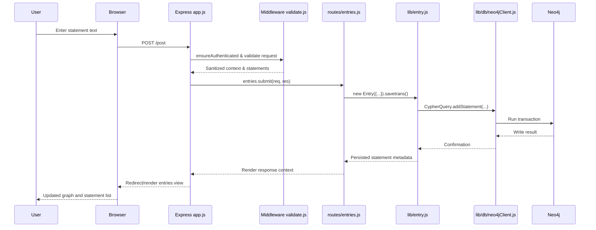
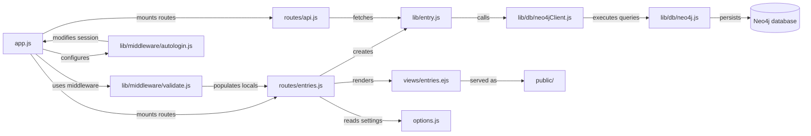

## Vibranodus is a revival of an Open Source Project that has dissappeared from the web.

It uses the magic of vibe coding to rapidly update old modules for InfraNodus, a text-to-network visualization tool, based on Neo4J Graph Database, Node.Js, Sigma.Js, and Graphology.


#### Vibranodus is a web app that can represent plain text as a graph. Every word is a node, every co-occurrence is a connection. We build a graph and apply network science algorithms to get insights about the connections in this graph. So you can encode any text or anything you want into a graph using #hashtags and @mentions). InfraNodus will visualize it, so you can analyze it. 


## 
## Features
* Visualize any text as a network graph
* Advanced graph analysis algorithms to study text
* Topic modeling 
* Most influential terms
* Advanced text statistics
* Graph / text comparison
* Works with English, German, French, Russian, Spanish, Portugese (+ Japanese and Chinese in the cloud version)
* Use InfraNodus to interface with your Neo4J database and to try some basic graph constructs using an easy input procedure via natural language, voice-to-text, or #hashtags


#### Works on mobile and desktop. Voice-to-text (EN, RU, FR, DE) is available.


## 
## The Science and the Method

Vibranodus is a non-commercial [venture fiction](https://noduslabs.com/research/venture-fiction/) project. Its main objective is to enhance perception and imagination, although it can also solve concrete problems and offer you an efficient way to retain, process, and make sense of information. It can:

* Help researchers make sense of textual data
* Help you retain and remember information
* Help you connect disjointed bits and pieces of data
* Visualize patterns in complex relations
* Be used for text network analysis
* Be used to quickly create graphs using text / voice input
* Perform comparative visual analysis of texts
* Identify the structure of discourse (dispersed / biased)
* Reveal the gaps in a network (and, thus, the potential for new ideas/connections)
* Provide network metrics, identify the main communities and top nodes

The method is mainly based on the approach outlined in Paranyushkin (2011) **[Identifying the Pathways of Meaning Circulation Using Text Network Analysis](https://noduslabs.com/research/pathways-meaning-circulation-text-network-analysis/)**.

A more precise description of InfraNodus' algorithm is presented in Paranyushkin (2019) **[InfraNodus — Generating Insight Using Text Network Analysis](http://bit.ly/infragitpdf)** (published in the [Proceedings for the WWW'19 The Web Conference](http://bit.ly/infragitacm)). If you use the tool, you can cite this paper.

A more easy-to-read article on the tool is published in **[Towards Data Science](https://towardsdatascience.com/measuring-discourse-bias-using-text-network-analysis-9f251be5f6f3)**.


##
## Introduction

The basic ideas behind InfraNodus are:

- [Graph DB model](https://github.com/deemeetree/graphdbmodel) suitable for large graphs and collaboration.
- Represent text as a network of interconnected nodes.
- Works on desktop and mobile.
- Make it easy to add nodes into a graph through a simple web interface.
- Work with what people already know and use well: #hashtags and @mentions, not nodes and edges.
- Use natural language to enter nodes in a graph (English and Russian morphology is supported)
- Move away from binary edges (e.g. A < - > B) to hyperedges in one statement (e.g. A and B and C or D)
- API and JSON export of all data;
- Twitter, Evernote, Gmail, Google, YouTube subtitles, RSS import (TODO: gexf, xml, csv upload)
- Enable people to use ше collaboratively, both locally and over the internet
- Your suggestions? (open an issue)


##
## Technology

InfraNodus is built on

* [Sigma.Js](http://github.com/jacomyal/sigma.js) for graph visualization;
* [Neo4J](http://neo4j.org) ver 3.x for graph database storage
* [Graphology](https://graphology.github.io/) for graph metrics calculations (Modularity)
* [JSNetworksX](http://jsnetworkx.org/) for graph metrics calculations (BC)
* [Cytoscape](https://github.com/cytoscape/cytoscape.js) for some graph metrics
* jQuery for the front-end
* Node.Js for the back-end
* Express Node.Js library;
* [neo4j-driver](https://github.com/neo4j/neo4j-javascript-driver);
* [Textexture](http://textexture.com) algorithm for text network visualization;
* Open-source code from the people on StackOverflow and Neo4J community;

## Architecture diagrams

### Project folders and key files

```mermaid
flowchart TB
    root((vibranodus/))
    root --> app[app.js]
    root --> options[options.js]
    root --> config[config.json.sample]
    root --> docker[Docker assets]
    subgraph docker [Containerization]
        docker --> dockerfile[Dockerfile]
        docker --> compose[docker-compose.yml]
        docker --> vagrant[Vagrantfile]
    end
    root --> libdir{{lib/}}
    subgraph libdir [lib/]
        libdir --> entry[entry.js]
        libdir --> user[user.js]
        libdir --> messages[messages.js]
        libdir --> middleware{{middleware/}}
        subgraph middleware [middleware/]
            middleware --> autologin[autologin.js]
            middleware --> usermw[user.js]
            middleware --> validate[validate.js]
            middleware --> page[page.js]
        end
        libdir --> db{{db/}}
        subgraph db [db/]
            db --> neo4jclient[neo4jClient.js]
            db --> neo4jcore[neo4j.js]
        end
        libdir --> tools{{tools/}}
    end
    root --> routesdir{{routes/}}
    subgraph routesdir [routes/]
        routesdir --> api[api.js]
        routesdir --> api2[api2.js]
        routesdir --> entriesRoute[entries.js]
        routesdir --> loginRoute[login.js]
        routesdir --> registerRoute[register.js]
        routesdir --> settingsRoute[settings.js]
        routesdir --> importsRoute[imports.js]
    end
    root --> publicdir[public/]
    root --> viewsdir[views/]
    viewsdir --> entriesView[entries.ejs]
    viewsdir --> postView[post.ejs]
    root --> neo4jdir{{neo4j/}}
    neo4jdir --> initCypher[init.cypher]
    root --> migration[migration-assistant/]
```

### Statement submission flow



### Module interaction overview



##
## Deployment Options

### Docker

**Prerequisites**

- Docker Engine 24+ or Docker Desktop.
- Docker Compose V2 (bundled with modern Docker distributions).
- Optional: a `.env` file in the project root when you want to override default credentials.

**Build the container image**

The `docker-compose.yml` builds an application image from the local `Dockerfile`. If you want to build it manually—for example to push it to a registry—run:

```
docker build -t vibranodus:local .
```

**Launch the full stack**

1. Copy the sample configuration if you need to customize API credentials: `cp config.json.sample config.json`.
2. Provide Neo4j connection details via environment variables. You can place them in a `.env` file that sits alongside the compose file:

   ```
   NEO4J_URI=bolt://neo4j:7687
   NEO4J_USERNAME=neo4j
   NEO4J_PASSWORD=secure-password
   INVITATION_CODE=changeme
   COOKIE_SECRET=super-secret-cookie-key
   ```

3. Build and start the services:

   ```
   docker compose up --build
   ```

The compose file exposes the web application on http://localhost:3000 and Neo4j on ports 7474 (HTTP) and 7687 (Bolt).

**Troubleshooting**

Some Docker Desktop installations may show a BuildKit error such as `failed to prepare extraction snapshot ... parent snapshot ... does not exist` the first time you attempt to build the images after Docker's auto-login update. When this happens, clean the builder cache with `docker buildx prune -af` (or `docker builder prune -af`) and rebuild the services with `docker compose build --no-cache` before retrying `docker compose up`. You might need to repeat this workaround whenever the error reappears on Windows or macOS Docker Desktop setups.

**Environment variables and secrets**

InfraNodus reads runtime configuration from environment variables first and falls back to `config.json` for any values that are not provided. The most important variables to supply in Docker deployments are:

- `NEO4J_URI` / `NEO4J_BOLT_URI` – Bolt connection string (defaults to `bolt://neo4j:7687`).
- `NEO4J_USERNAME` / `NEO4J_PASSWORD` – Database credentials; they are also passed to the Neo4j service through `NEO4J_AUTH`.
- `INVITATION_CODE` – Invitation code required on `/signup`.
- `COOKIE_SECRET` – Secret string used to sign session and cookie data.
- `INFRANODUS_AUTO_LOGIN` – Enables the bypass middleware so local stacks can skip the login page (enabled by default in `docker-compose.yml`).
- `DEFAULT_USER` – Username used for the automatic login flow (the compose file defaults it to `local-demo`).
- `SITE_DOMAIN` – Optional value that appears in e-mails and default profiles.
- Third-party credentials such as the Twitter, Evernote, and Google keys defined in `config.json.sample`.

Place them into a `.env` file or export them in the shell before running Compose. Any keys that are not supplied via the environment will continue to use the values defined in `config.json`, preserving compatibility with existing deployments.

The default Compose configuration ships with `INFRANODUS_AUTO_LOGIN=1` and `DEFAULT_USER=local-demo`, so the application boots into a pre-authenticated session for local development. Adjust or remove these variables if you prefer to exercise the standard login and signup flows.

**Volumes and persistent data**

- `neo4j_data` – Stores the graph database content under `/data`.
- `neo4j_plugins` – Persists APOC and any additional Neo4j plugins under `/plugins`.
- Optional bind mount `./config.json:/usr/src/app/config.json:ro` – Uncomment in `docker-compose.yml` if you want to inject a local configuration file instead of baking it into the image.

Stopping the stack with `docker compose down -v` removes the named volumes. Keep them intact if you want to preserve graph data between runs.

**Neo4j initialization workflow**

During start-up the `neo4j-init` one-shot service waits for the database to accept Bolt connections and then runs the Cypher statements in [`neo4j/init.cypher`](neo4j/init.cypher) through `cypher-shell`. The script enables the APOC triggers required by InfraNodus and creates the recommended indexes using Neo4j 5.x syntax. The Neo4j service loads the APOC plugin automatically via the `NEO4JLABS_PLUGINS` environment variable, so the procedures are ready by the time the init job runs.

If you ever reset the Neo4j volumes (for example by running `docker compose down -v`), rerun the initialization after the database starts:

```
docker compose run --rm neo4j-init
```

The command reuses the same container image and Cypher script, ensuring the schema stays in sync without having to restart the full stack.

To create an account on your local machine, visit http://localhost:3000/signup?invitation=secretcode - replace `secretcode` with the value of `secrets.invitation` in your `config.json`.

When you sign up, please, consider creating an account on [www.infranodus.com](http://infranodus.com) to support the development of this tool. Subscribers get fast-track support and help on the technical issues of the installation.

### Manual setup

1. Install Neo4j 3.3.9–3.5 locally or provision a managed instance. See [How to Set Up Neo4j for InfraNodus](https://github.com/noduslabs/infranodus/wiki/Neo4J-Database-Setup) for indexes and APOC guidance.
2. Install Node.js and npm.
3. `git clone` this repository and `cd` into it.
4. Install dependencies with `npm install`.
5. Copy `config.json.sample` to `config.json`, add the required API credentials, and customize the analytics partials in `/views/statsheader.ejs`, `/views/statsabove.ejs`, and `/views/statsbelow.ejs` if you plan to embed tracking scripts.
6. Export any additional environment variables described above or keep them inside `config.json`.
7. Start the server with `node app.js` and visit http://localhost:3000.

### Vagrant virtual machine

1. `git clone` the project.
2. `cd infranodus` to switch into the git project directory.
3. `cp config.json.sample config.json` and modify the file as necessary—for example, add Evernote and/or Twitter credentials. Note: if you change the Neo4j database password here, you'll also need to change it in your local copy of `/vagrant/setup-neo4j.sh`.
4. Run `vagrant up` in the project folder. This may take a while the first time, as it installs an Ubuntu VM and all dependencies.
5. `vagrant ssh` to log on to the virtual machine.
6. `cd /vagrant` to get into the project directory on the virtual machine.
7. `node app.js` to run the application.
8. Access the app from http://192.168.66.101:3000. If you want a different IP address, change the `ip` setting under `config.vm.network` in the `Vagrantfile`.
9. Visit http://192.168.66.101:3000/signup?invitation=secretcode to create an account—replace `secretcode` with the value of `secrets.invitation` in your `config.json`.


##
## Data Model

The general rationale for the data model used in InfraNodus is outlined in
* [Cognitive Network Protocol](http://noduslabs.com/research/cognitive-network-protocol/) article (more specific)
* [From Cognitive Interfaces to Transcendental Protocols](http://noduslabs.com/research/cognitive-interfaces-transcendental-protocols/) article (more general)
* [Graph Database Model Draft](https://github.com/deemeetree/graphdbmodel) detailed description

The main properties of this model are

- There are 5 labels (types) for nodes: Concepts, Statements, Contexts, Users, and Narratives
- Every expression of a user into the system is a Statement
- Example: "#antibiotics can fight #bacteria which are #dangerous for #health" is the user's input. The system creates 4 :Concept nodes from the hashtags inside the :Statement, which is linked to the :Context (by default, "@private") and all those are attached to the :User.
- Types of connections: :TO (between Concepts), :AT (Concepts to Context), :OF (Concepts to Statement), :IN (Statement to Context), :BY (to User)
- Narrative is implemented through creating a :Narrative node, which is linked to from Statements and Concepts by :INTO type of connection (think of :Narrative as another :Context)
- Narrative elements are linked to each other via :THRU type of connection.

This data model enables to create custom views for any kind of data and introduce the idea of narrative into holistic graph views.

This data model is derived from the [Cognitive Graph DB Model](http://noduslabs.com/cases/graph-database-structure-specification/) draft created by Nodus Labs.

The current data model description utilized in InfraNodus app is available in https://github.com/noduslabs/graphdbmodel repository.


##
## Mobile Interface

InfraNodus can also be used on a mobile.


##
## Python Port

Together with Mattias Östmar (who did most of the work) we created a port of InfraNodus in Python, focusing on the measure of network diversity structure that it provides.

You can get it in [DiscourseDiversity](https://gitlab.com/mattiasostmar/discoursediversity) repo on GitLab. We're still working on it, but if you like Jupyter notebooks and network analysis, there's some good stuff to find in there!

* [InfraNodus in Python](https://gitlab.com/mattiasostmar/discoursediversity)


##
## Special Thanks

InfraNodus could not be built without the
* Help from the people on StackOverflow and Neo4J community;

Also... :)
* Special thanks to [Oleg Yarin](https://github.com/monapasan) for his support and to [Mattias Östmar](https://gitlab.com/mattiasostmar) for his energy and inspiration;


##
## GPL License

This open source, free software is available under the GNU Affero General Public License version 3 (AGPLv3) license.
You can make modifications to this code and binaries based on it, but only on the condition that you provide access to those modifications under the same license (including remotely  through a computer network).
It is provided as is, with no guarantees and no liabilities.
You can re-use it as long as you keep this notice inside the code.

**You are very welcome to join the project!**

Created by Dmitry Paranyushkin of [Nodus Labs](http://www.noduslabs.com), conceptualized via [Polysingularity](http://polysingularity.com), inspired from [ThisIsLike.Com](http://thisislike.com), and [KnowNodes (now Rhizi)](http://rhizi.org) co-developed at [Center for Interdisciplinary Research](http://cri-paris.org).

This project would not be possible without the help from StackOverflow community. Thank you so much!

Copyright (C) [Dmitry Paranyushkin](http://github.com/deemeetree) | [Nodus Labs](http://www.noduslabs.com) and hopefully you also!
(http://www.noduslabs.com) | info AT noduslabs DOT com

In some parts the code from the book ["Node.js in Action"](http://www.manning.com/cantelon/) is used
(c) 2014 Manning Publications Co.
Any source code files provided as a supplement to the book are freely available to the public for download. Reuse of the code is permitted, in whole or in part, including the creation of derivative works, provided that you acknowledge that you are using it and identify the source: title, publisher and year.

Some parts of this code may come under a different license if specified within.
